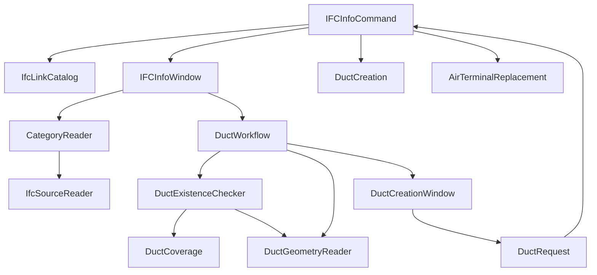

# Sơ đồ class — IFCInfo, Revit 2024

Mở `IFCInfo.csproj`. Mã nguồn nằm trong `src/`; mỗi class cấp cao có một file cùng tên. Namespace `IFCInfo` và tên DLL giữ nguyên để add-in tiếp tục nạp được.

## Thứ tự nên đọc

1. `Commands/IFCInfoCommand.cs`: điểm bắt đầu khi chạy tool.
2. `Services/IfcLinkCatalog.cs`: tìm IFC link cho dropdown.
3. `Services/CategoryReader.cs`: đọc Category, System Type, System Name; ghép thông tin theo GUID.
4. `UI/IFCInfoWindow.cs`: giao diện bước 1–2 và các sự kiện nút.
5. `Services/Ducts/DuctWorkflow.cs`: chuẩn bị dữ liệu cho bước tạo Duct.
6. `Services/Ducts/DuctExistenceChecker.cs`: cập nhật cột Duct đã tồn tại.
7. `Services/Ducts/DuctGeometryReader.cs`: xác định đường tim và tiết diện nguồn.
8. `Services/Ducts/DuctCreation.cs`: tạo Duct và quản lý transaction.

Các đường dẫn trên tính từ `src/`.

## Tra cứu theo việc cần kiểm tra

| Việc cần xem hoặc sửa | Class / file trong src |
|---|---|
| Khởi chạy, mở cửa sổ, thực thi yêu cầu | `Commands/IFCInfoCommand.cs` |
| Danh sách link, nhận diện IFC, trạng thái load | `Services/IfcLinkCatalog.cs` |
| Category, parameter, System Type / System Name | `Services/CategoryReader.cs` |
| Giao diện chính, cột bảng, xuất clipboard | `UI/IFCInfoWindow.cs` |
| Màu sắc, icon, dropdown, thanh bước | `UI/UiDesign.cs` |
| Chọn type và ánh xạ hệ thống trước khi tạo ống | `UI/DuctCreationWindow.cs` |
| Chọn family / Level để tạo miệng gió | `UI/AirTerminalReplacementWindow.cs` |
| Đọc IFC2X3, đơn vị, hệ thống, kích thước | `Ifc/IfcSourceReader.cs` |
| Chuẩn bị và kiểm tra danh sách ống sẽ tạo | `Services/Ducts/DuctWorkflow.cs` |
| Duct đã tồn tại ở vị trí nguồn hay chưa | `Services/Ducts/DuctExistenceChecker.cs` |
| Thuật toán trùng toàn bộ / một phần đường tim, độc lập Revit | `Services/Ducts/DuctCoverage.cs` |
| Đọc solid hoặc Duct native, xác định hình học | `Services/Ducts/DuctGeometryReader.cs` |
| Duct.Create, đặt kích thước, góc, transaction, chống tạo lại | `Services/Ducts/DuctCreation.cs` |
| Tạo miệng gió, chọn host, chống tạo lại | `Services/AirTerminals/AirTerminalReplacement.cs` |

## Các class dữ liệu — Models/

| Class | Nội dung |
|---|---|
| `LinkOption` | Lựa chọn IFC link: ID, tên, đường dẫn, trạng thái load. |
| `CategoryOption` | Lựa chọn Category. |
| `AirTerminalRow` | Dòng trong bảng MEP, hiện dùng chung cho cả Duct và Air Terminal; giữ tên cũ để tránh thay đổi liên kết hiện có. |
| `IfcTerminalSource` | Dữ liệu IFC theo GUID; dùng cho cả miệng gió và ống. |
| `DuctPlanItem` | Đường tim, tiết diện và nguồn của một Duct sẽ tạo. |
| `DuctChoice` | Một Duct Type hoặc System Type có thể chọn. |
| `DuctRequest` | Danh sách ống và ánh xạ type đã chọn để tạo. |
| `ReplacementTypeOption` | Family type miệng gió và khả năng đặt host. |
| `ReplacementLevelOption` | Level cho miệng gió. |
| `ReplacementRequest` | Các lựa chọn đã xác nhận để tạo miệng gió. |

Các class phụ chỉ dùng nội bộ (ví dụ Profile, bộ xử lý lỗi transaction, entity STEP) vẫn nằm trong class sở hữu. `DuctCoverage.Segment` và `DuctCoverage.Result` giữ dạng lồng để bảo toàn API kiểm tra hiện có.

## Luồng gọi chính

## Điểm cần lưu ý khi kiểm tra

- Tạo Duct: dung sai hình học giữ nguyên `0.002 feet` (khoảng 0,6 mm).
- Cột đã tồn tại: so đường tim trong model chính với sai số `1 mm`, không kiểm tra kích thước hoặc hệ thống.
- `DuctWorkflow.Configure` phải chạy sau `CategoryReader.Configure`: workflow bổ sung bước kiểm tra tồn tại vào callback đọc Category.
- Thay đổi lần này là tổ chức lại mã, không thay đổi quy tắc tạo ống hoặc giao diện.
- Project chỉ compile `src/**/*.cs`. Bản mã cũ được chuyển sang thư mục backup trong `work/`, tránh có hai bản dễ nhầm.

## Kiểm tra đã chạy

- Build Release: 0 lỗi, 0 cảnh báo.
- Giao diện: dropdown link/Category, chuyển bước, đổi link, link chưa load, cột trạng thái và dữ liệu xuất.
- Hộp thoại tạo Duct: chặn tạo khi chưa ánh xạ System Type.
- IFC mẫu: 1.084 Duct, 1.053 đoạn đọc được kích thước, 509 Air Terminal, 148 hệ thống.
- Thuật toán đường tim: kiểm tra nhiều đoạn liên tiếp phủ đủ chiều dài.
- 24 file class cấp cao có tên file trùng tên class.
- Chưa kiểm thử transaction tạo phần tử trực tiếp trong Revit sau refactor.
